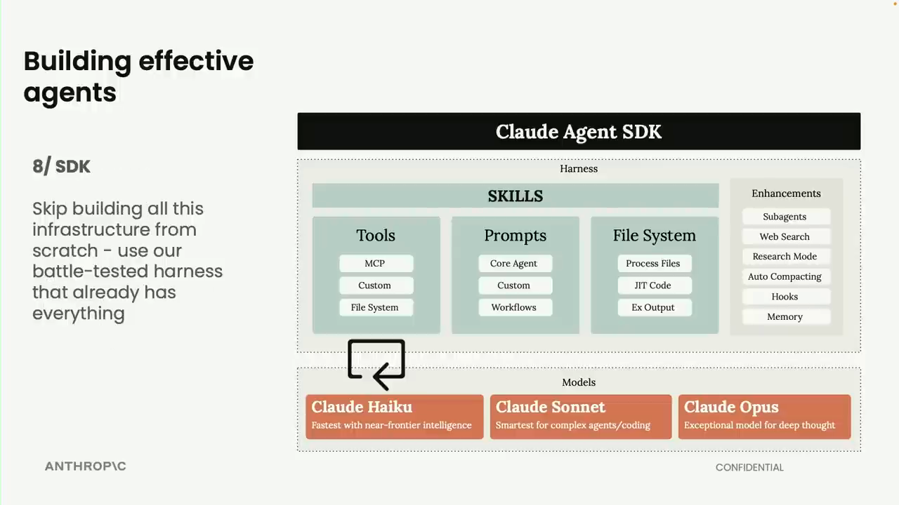

# 02 — What Is an Agent Harness?

## The One-Sentence Definition

The harness is the infrastructure layer that sits between the LLM and the outside world — it transforms a raw model API call into a functioning autonomous agent.

> **Without a harness:** a model that answers questions.
> **With a harness:** a model that plans, calls tools, handles errors, manages context, spawns subagents, and loops until a task is done.

---

## What the Harness Provides

| Capability | What it does |
|------------|-------------|
| **Tool execution engine** | Receives the model's tool call, runs it safely, returns the result |
| **Context management** | Tracks conversation state, compresses when approaching limits (auto-compacting) |
| **Agent loop control** | Decides when to continue, pause, hand off to human, or stop |
| **Error recovery** | Catches failed tool calls, lets the model retry or route around |
| **Subagent spawning** | Creates child agents, coordinates their outputs back to the orchestrator |
| **Hooks** | Pre/post-tool intercepts for logging, safety checks, approval workflows |
| **Memory management** | Reads/writes long-term memory at the right moments in the loop |

---

## The Claude Agent SDK Architecture

The diagram below (from Thariq Shihipar's [Claude Agent SDK Full Workshop](https://www.youtube.com/watch?v=TqC1qOfiVcQ), at 6:01) shows the harness architecture Anthropic ships:



**Architecture breakdown:**

```
┌──────────────────────────────────────────────┐
│              CLAUDE AGENT SDK                │
│                                              │
│  ┌─────────────────┐  ┌───────────────────┐  │
│  │     SKILLS      │  │   ENHANCEMENTS    │  │
│  │                 │  │                   │  │
│  │  Tools          │  │  Subagents        │  │
│  │  ├─ MCP         │  │  Web Search       │  │
│  │  ├─ Custom      │  │  Research Mode    │  │
│  │  └─ File System │  │  Auto-Compacting  │  │
│  │                 │  │  Hooks            │  │
│  │  Prompts        │  │  Memory           │  │
│  │  ├─ Core Agent  │  └───────────────────┘  │
│  │  ├─ Custom      │                         │
│  │  └─ Workflows   │                         │
│  │                 │                         │
│  │  File System    │                         │
│  │  ├─ Process     │                         │
│  │  ├─ JIT Code    │                         │
│  │  └─ Ex Output   │                         │
│  └─────────────────┘                         │
├──────────────────────────────────────────────┤
│                   MODELS                     │
│                                              │
│  ┌──────────┐  ┌──────────┐  ┌───────────┐  │
│  │  Haiku   │  │  Sonnet  │  │   Opus    │  │
│  │  Fastest │  │ Smartest │  │ Deep      │  │
│  │          │  │ for code │  │ thought   │  │
│  └──────────┘  └──────────┘  └───────────┘  │
└──────────────────────────────────────────────┘
```

**Key insight from Anthropic's framing:** *"Skip building all this infrastructure from scratch — use our battle-tested harness that already has everything."*

---

## Harness vs. Graph: Choosing Your Agent Type

| Dimension | Harness (Type 1) | Graph (Type 2) |
|-----------|-----------------|----------------|
| **Examples** | Claude Code, Codex, Agent SDK | LangGraph, CrewAI |
| **Who defines the loop** | The LLM decides next steps | Developer authors nodes + edges |
| **Flexibility** | Maximum — model chooses | Controlled — developer constrains |
| **Auditability** | Lower — implicit decisions | High — every transition is explicit |
| **Debuggability** | Harder — reasoning is opaque | Easier — state is inspectable |
| **Resumability** | Varies | Built-in (LangGraph checkpointing) |
| **Best for** | Open-ended, high-autonomy tasks | Production, compliance, HITL |
| **Time to first working agent** | Fast | Slower (but more robust at scale) |

### Decision Rule
- **Can you write a complete flowchart before running the task?** → Graph (LangGraph)
- **Is the sequence of steps unknowable in advance?** → Harness (Claude Code / Agent SDK)
- **Do you need human approval at specific checkpoints?** → Graph
- **Is this a research, coding, or open-ended reasoning task?** → Harness

---

## Further Reading

- [Claude Agent SDK Full Workshop — Thariq Shihipar, Anthropic](https://www.youtube.com/watch?v=TqC1qOfiVcQ) *(diagram at 6:01)*
- [Anthropic — Effective Harnesses for Long-Running Agents](https://www.anthropic.com/engineering/effective-harnesses-for-long-running-agents)
- [LangGraph — Why LangGraph?](https://langchain-ai.github.io/langgraph/concepts/why-langgraph/)
