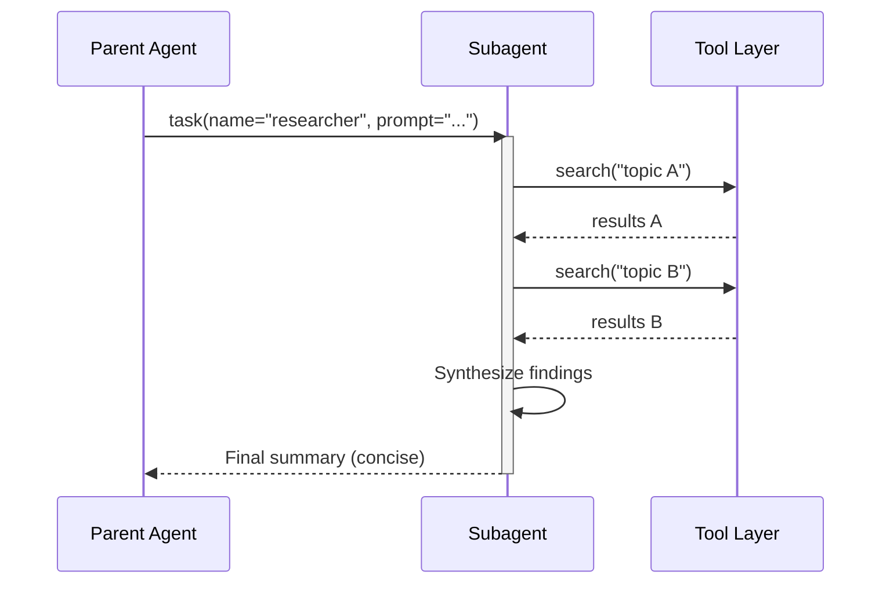
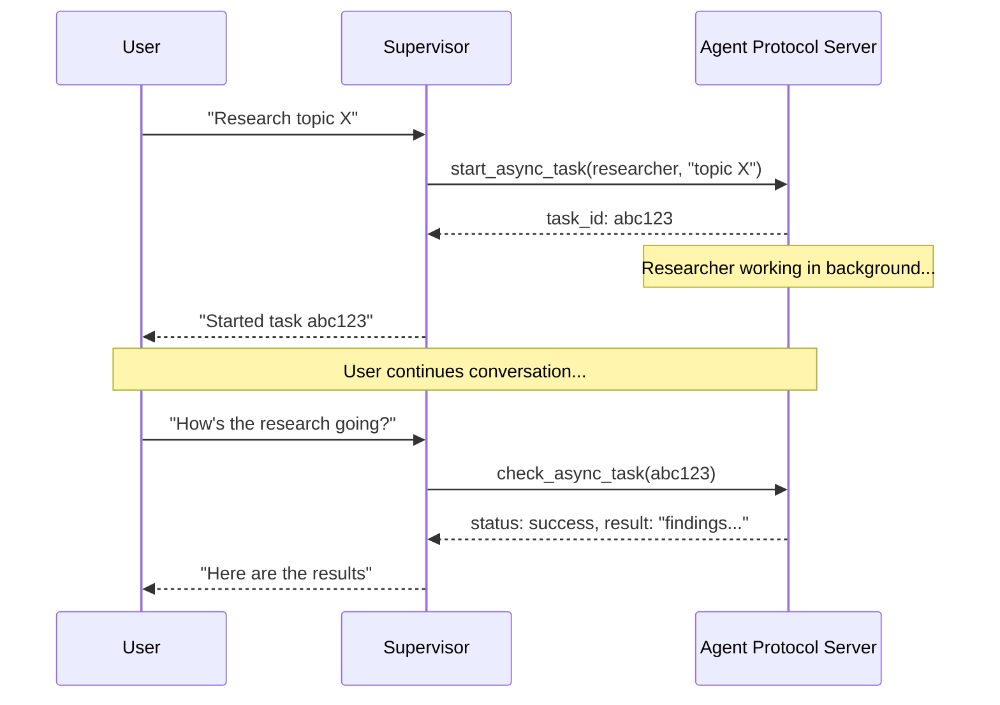

# LangChain Deep Agents: Subagents & Async Patterns

A comprehensive guide to subagent architecture and async execution patterns in LangChain Deep Agents.

---

## 1. Subagent Fundamentals

### What Are Subagents?

Subagents are specialized agent instances that a **parent (supervisor) agent** creates to delegate work. They enable **context quarantine** — isolating detailed work from the main agent's context window.

```
┌─────────────────┐     task tool      ┌─────────────────┐
│   Main Agent    │ ─────────────────> │   Subagent      │
│   (Supervisor)  │                    │   (Researcher,  │
│                 │ <───────────────── │    Coder, etc.) │
└─────────────────┘    Final Result     └─────────────────┘
                              │
                              ▼
                    ┌─────────────────┐
                    │  Isolated Work  │
                    │  - Research     │
                    │  - Code gen     │
                    │  - Analysis     │
                    └─────────────────┘
```

### Parent-Child Relationships

| Aspect | Parent Agent | Child Subagent |
|--------|-------------|----------------|
| **Role** | Orchestrates, coordinates, decides | Executes specialized tasks |
| **Context** | Maintains high-level conversation | Isolated task-specific context |
| **Tools** | May have broad tool access | Minimal, focused tool set |
| **Output** | Receives final results only | Returns concise summaries |
| **Lifecycle** | Long-running, stateful | Task-scoped, ephemeral |

### Key Principle: Context Isolation

When subagents perform multi-step work (e.g., 10 web searches), only the **final result** returns to the parent — not the intermediate tool calls, raw search results, or reasoning traces. This prevents context window bloat.

---

## 2. When to Spawn Subagents

### ✅ When to Use Subagents

| Scenario | Rationale |
|----------|-----------|
| **Multi-step tasks** | Research requiring multiple searches, data gathering, or tool calls |
| **Specialized domains** | Tasks needing custom instructions (legal review, code generation, medical analysis) |
| **Different model capabilities** | Some models excel at specific tasks (long context, numerical analysis, creative writing) |
| **Context quarantine** | Keeping detailed intermediate work out of the main agent's context |
| **Parallel workstreams** | When async subagents can run concurrently (see Section 4) |

### ❌ When NOT to Use Subagents

| Scenario | Better Alternative |
|----------|-------------------|
| **Simple, single-step tasks** | Direct tool call from parent agent |
| **Need intermediate context** | Inline execution to maintain reasoning chain |
| **Overhead outweighs benefits** | Small tasks where delegation adds latency without value |

### Decision Framework

```
Is the task complex/multi-step?
    ├── YES → Does it need specialized instructions or tools?
    │           ├── YES → Use custom subagent
    │           └── NO  → Use general-purpose subagent
    └── NO  → Use inline tool call
```

---

## 3. Communication Patterns

### The `task()` Tool Interface

Parent agents delegate to subagents via the `task` tool:

```python
# Parent agent calls:
task(name="research-agent", task="Research quantum computing trends")

# Subagent executes internally:
# - Performs multiple searches
# - Synthesizes findings
# - Returns: "Quantum computing market projected to reach $8B by 2030..."
```

### Communication Flow



### Configuration Types

#### Dictionary-Based SubAgent

```python
research_subagent = {
    "name": "research-agent",
    "description": "Conducts in-depth research using web search",
    "system_prompt": "You are a thorough researcher...",
    "tools": [internet_search],
    "model": "openai:gpt-5.2",  # Optional override
}
```

| Field | Required | Inherits from Parent |
|-------|----------|---------------------|
| `name` | ✅ | No |
| `description` | ✅ | No |
| `system_prompt` | ✅ | No |
| `tools` | ✅ | No |
| `model` | ❌ | Yes (if omitted) |
| `middleware` | ❌ | No |
| `skills` | ❌ | No (except general-purpose) |

#### CompiledSubAgent (LangGraph Graphs)

```python
from deepagents import CompiledSubAgent
from langchain.agents import create_agent

custom_graph = create_agent(
    model=your_model,
    tools=specialized_tools,
    prompt="You are a specialized agent..."
)

custom_subagent = CompiledSubAgent(
    name="data-analyzer",
    description="Specialized agent for complex data analysis",
    runnable=custom_graph
)
```

### Context Propagation

Runtime context automatically flows to all subagents:

```python
@dataclass
class Context:
    user_id: str
    session_id: str

# Context available in subagent tools automatically
result = await agent.invoke(
    {"messages": [HumanMessage("Look up my recent activity")]},
    context=Context(user_id="user-123", session_id="abc"),
)
```

### Per-Subagent Configuration

Use namespaced keys for subagent-specific settings:

```python
@dataclass
class Context:
    user_id: str
    researcher_max_depth: int | None = None
    fact_checker_strict_mode: bool | None = None
```

---

## 4. Async Subagents

### Why Async Matters

| Benefit | Description |
|---------|-------------|
| **Non-blocking execution** | Supervisor continues interacting with users while subagents work |
| **True parallelism** | Multiple subagents run concurrently, not sequentially |
| **Mid-flight steering** | Send follow-up instructions to running tasks |
| **Cancellation** | Stop running tasks that are no longer needed |
| **Stateful persistence** | Subagents maintain state across multiple interactions |

### Sync vs Async Comparison

| Dimension | Sync Subagents | Async Subagents |
|-----------|---------------|-----------------|
| **Execution model** | Supervisor blocks until completion | Returns job ID immediately; supervisor continues |
| **Concurrency** | Parallel but blocking | Parallel and non-blocking |
| **Mid-task updates** | Not possible | Send follow-up via `update_async_task` |
| **Cancellation** | Not possible | Cancel via `cancel_async_task` |
| **Statefulness** | Stateless between invocations | Stateful across interactions |
| **Best for** | Tasks where agent should wait | Long-running, interactive tasks |

### Async Subagent Lifecycle



### Async Tools Available

| Tool | Purpose | Returns |
|------|---------|---------|
| `start_async_task` | Start a new background task | Task ID (immediately) |
| `check_async_task` | Get status and result | Status + result (if complete) |
| `update_async_task` | Send new instructions to running task | Confirmation + updated status |
| `cancel_async_task` | Stop a running task | Confirmation |
| `list_async_tasks` | List all tracked tasks | Summary of all tasks |

### Configuration

```python
from deepagents import AsyncSubAgent, create_deep_agent

async_subagents = [
    AsyncSubAgent(
        name="researcher",
        description="Research agent for information gathering",
        graph_id="researcher",
        # No url → ASGI transport (co-deployed)
    ),
    AsyncSubAgent(
        name="coder",
        description="Coding agent for code generation",
        graph_id="coder",
        url="https://coder-deployment.langsmith.dev"  # HTTP transport
    ),
]
```

### State Management

Task metadata is stored in a dedicated state channel (`async_tasks`), separate from message history. This ensures task IDs survive context compaction:

```python
# Each task tracks:
- task_id
- agent_name
- thread_id
- run_id
- status
- timestamps (created_at, last_checked_at, last_updated_at)
```

---

## 5. Orchestrator-Workers Pattern

### Pattern Overview

The **Orchestrator-Workers** pattern is the canonical Deep Agents implementation for parallel task execution:

```
┌─────────────────┐
│  Orchestrator   │  (Supervisor agent)
│  - Plans tasks  │
│  - Delegates    │
│  - Aggregates   │
└────────┬────────┘
         │
    ┌────┴────┬────────┬────────┐
    ▼         ▼        ▼        ▼
┌───────┐ ┌───────┐ ┌───────┐ ┌───────┐
│Worker1│ │Worker2│ │Worker3│ │WorkerN│
│Research│ │Research│ │Research│ │Research│
│Task A │ │Task B │ │Task C │ │Task N │
└───┬───┘ └───┬───┘ └───┬───┘ └───┬───┘
    └────┬────┴────────┴────────┘
         ▼
┌─────────────────┐
│  Orchestrator   │
│  - Collects     │
│  - Synthesizes   │
│  - Returns final │
└─────────────────┘
```

### Deep Agents Implementation

```python
from deepagents import create_deep_agent

# Define specialized workers
subagents = [
    {
        "name": "data-collector",
        "description": "Gathers raw data from various sources",
        "system_prompt": "Collect comprehensive data...",
        "tools": [web_search, api_call, database_query],
    },
    {
        "name": "data-analyzer",
        "description": "Analyzes collected data for insights",
        "system_prompt": "Analyze data and extract key insights...",
        "tools": [statistical_analysis],
    },
    {
        "name": "report-writer",
        "description": "Writes polished reports from analysis",
        "system_prompt": "Create professional reports...",
        "tools": [format_document],
    },
]

# Orchestrator agent
agent = create_deep_agent(
    model="claude-sonnet-4-6",
    system_prompt="""You coordinate data analysis and reporting. 
    Use subagents for specialized tasks:
    1. Delegate data collection to data-collector
    2. Pass results to data-analyzer
    3. Send insights to report-writer
    4. Compile and return final output""",
    subagents=subagents
)
```

### Workflow Steps

1. **Orchestrator creates high-level plan**
2. **Delegates to specialized subagents** (potentially in parallel with async)
3. **Each subagent works with clean, focused context**
4. **Orchestrator aggregates results**
5. **Returns synthesized final output**

### Async Parallelization

For maximum throughput, combine Orchestrator-Workers with async subagents:

```python
# Start multiple workers concurrently
task_1 = start_async_task("researcher", "Research topic A")
task_2 = start_async_task("researcher", "Research topic B")
task_3 = start_async_task("coder", "Generate code for feature X")

# Check results as needed
result_1 = check_async_task(task_1)
result_2 = check_async_task(task_2)
result_3 = check_async_task(task_3)
```

---

## 6. Best Practices

### Write Clear Descriptions

The main agent uses descriptions to select subagents. Be specific and action-oriented:

```python
# ✅ Good
{"name": "contract-reviewer", 
 "description": "Reviews legal documents and contracts for compliance issues, risk factors, and actionable clauses"}

# ❌ Bad
{"name": "helper", "description": "helps with stuff"}
```

### Keep System Prompts Detailed

Include specific guidance on tool usage and output format:

```python
research_subagent = {
    "system_prompt": """You are a thorough researcher. Your job is to:
    1. Break down the research question into searchable queries
    2. Use internet_search to find relevant information
    3. Synthesize findings into a comprehensive but concise summary
    4. Cite sources when making claims

    Output format:
    - Summary (2-3 paragraphs)
    - Key findings (bullet points)
    - Sources (with URLs)

    Keep your response under 500 words."""
}
```

### Minimize Tool Sets

Only give subagents the tools they need:

```python
# ✅ Good: Focused
email_agent = {"tools": [send_email, validate_email]}

# ❌ Bad: Unfocused
email_agent = {"tools": [send_email, web_search, database_query, file_upload]}
```

### Choose Models by Task

```python
subagents = [
    {
        "name": "contract-reviewer",
        "description": "Reviews legal documents",
        "model": "claude-sonnet-4-6",  # Large context for long docs
    },
    {
        "name": "financial-analyst",
        "description": "Analyzes financial data",
        "model": "openai:gpt-5",  # Better for numerical analysis
    },
]
```

### Return Concise Results

Instruct subagents to return summaries, not raw data:

```python
data_analyst = {
    "system_prompt": """Analyze the data and return:
    1. Key insights (3-5 bullet points)
    2. Overall confidence score
    3. Recommended next actions

    Do NOT include raw data or intermediate calculations.
    Keep response under 300 words."""
}
```

### Resource Management (Async)

Size the worker pool appropriately:

```bash
# Each active run occupies a worker slot
# Supervisor + 3 concurrent subagents = 4 slots minimum
langgraph dev --n-jobs-per-worker 10
```

### Error Handling

- Subagents should handle their own errors internally
- Return error summaries to parent, not stack traces
- Parent decides whether to retry, escalate, or continue

### Result Aggregation

The orchestrator should:
1. Collect results from all workers
2. Validate completeness
3. Synthesize into coherent output
4. Handle partial failures gracefully

---

## 7. Common Pitfalls

### ❌ Subagent Not Being Called

**Problem**: Main agent tries to do work itself instead of delegating.

**Solutions**:
- Make descriptions more specific about when to use the subagent
- Add explicit instructions to system prompt: `"For complex tasks, delegate to subagents"`

### ❌ Context Still Bloated

**Problem**: Context fills up despite using subagents.

**Solutions**:
- Instruct subagent to return only essential summaries
- Use filesystem for large intermediate data
- Set explicit word limits in system prompts

### ❌ Wrong Subagent Selected

**Problem**: Main agent calls inappropriate subagent.

**Solution**: Differentiate clearly in descriptions:

```python
subagents = [
    {
        "name": "quick-researcher",
        "description": "For simple questions needing 1-2 searches. Use for basic facts.",
    },
    {
        "name": "deep-researcher",
        "description": "For complex research requiring multiple searches and synthesis.",
    }
]
```

### ❌ Supervisor Polling After Async Launch

**Problem**: Supervisor calls `check` immediately, turning async into blocking.

**Solution**: Reinforce in system prompt:

```python
system_prompt="""After launching an async subagent, ALWAYS return control to the user.
Never call check_async_task immediately after launch."""
```

### ❌ Stale Status References

**Problem**: Supervisor references task status from conversation history instead of checking fresh.

**Solution**: The middleware injects: `"Task statuses in conversation history are always stale. Always call check or list before reporting status."`

### ❌ Task ID Lookup Failures

**Problem**: Supervisor truncates or reformats task IDs.

**Solution**: Add explicit instruction: `"Always show the full task_id, never truncate or abbreviate it."`

### ❌ Worker Pool Exhaustion

**Problem**: Subagent launches queue instead of running.

**Solution**: Increase `--n-jobs-per-worker` to accommodate concurrent runs.

---

## 8. Reference Links

### Official Documentation

| Resource | URL |
|----------|-----|
| **Subagents (Sync)** | <https://docs.langchain.com/oss/python/deepagents/subagents> |
| **Async Subagents** | <https://docs.langchain.com/oss/python/deepagents/async-subagents> |
| **Skills** | <https://docs.langchain.com/oss/python/deepagents/skills> |
| **Human-in-the-Loop** | <https://docs.langchain.com/oss/python/deepagents/human-in-the-loop> |
| **Deep Agents Customization** | <https://docs.langchain.com/oss/python/deepagents/customization> |

### API Reference

| Resource | URL |
|----------|-----|
| **CompiledSubAgent** | <https://reference.langchain.com/python/deepagents/middleware/subagents/CompiledSubAgent> |
| **SubAgent** | <https://reference.langchain.com/python/deepagents/middleware/subagents/SubAgent> |
| **AsyncSubAgent** | <https://reference.langchain.com/python/deepagents/middleware/async_subagents/AsyncSubAgent> |
| **AsyncSubAgentMiddleware** | <https://reference.langchain.com/python/deepagents/middleware/async_subagents/AsyncSubAgentMiddleware> |
| **SkillsMiddleware** | <https://reference.langchain.com/python/deepagents/middleware/skills/SkillsMiddleware> |

### Protocol & Implementation

| Resource | URL |
|----------|-----|
| **Agent Protocol** | <https://github.com/langchain-ai/agent-protocol> |
| **Async Deep Agents Examples** | <https://github.com/langchain-ai/async-deep-agents> |
| **LangSmith Deployments** | <https://docs.langchain.com/langsmith/deployment> |

### Related Concepts

| Resource | URL |
|----------|-----|
| **Context Quarantine** | <https://www.dbreunig.com/2025/06/26/how-to-fix-your-context.html#context-quarantine> |
| **LangGraph Graph API** | <https://docs.langchain.com/oss/python/langgraph/graph-api> |
| **Structured Output** | <https://docs.langchain.com/oss/python/langchain/structured-output> |

---

## Summary: First Principles

1. **Subagents enable parallelization and specialization** — Delegate work to focused agents with minimal tools and clear instructions.

2. **Async execution prevents blocking and improves throughput** — Launch background tasks, continue interacting with users, check results when ready.

3. **Parent agents should orchestrate, child agents should execute** — Parents maintain high-level context and coordinate; children handle detailed, isolated work.

4. **Context quarantine is the primary benefit** — Keep intermediate tool calls and raw data out of the main agent's context window.

5. **Concise returns prevent bloat** — Always instruct subagents to return summaries, not raw data.

---

*Last updated: 2025-04-07*
